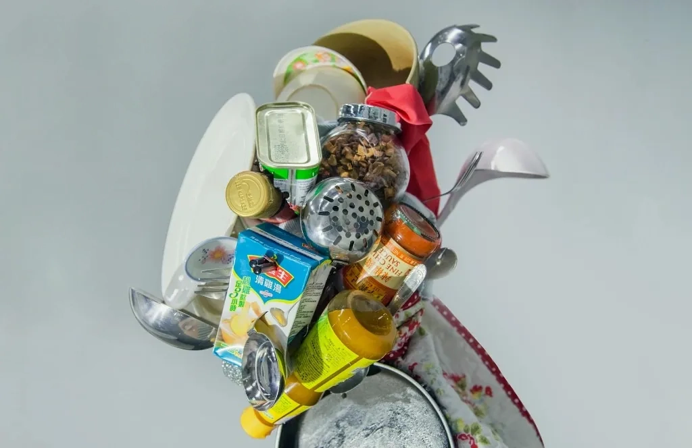
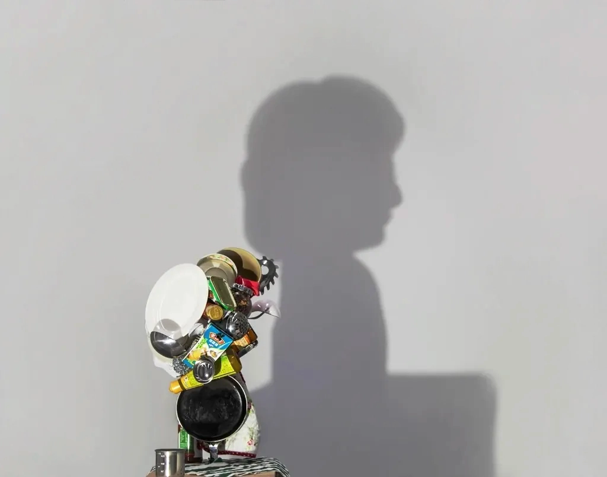
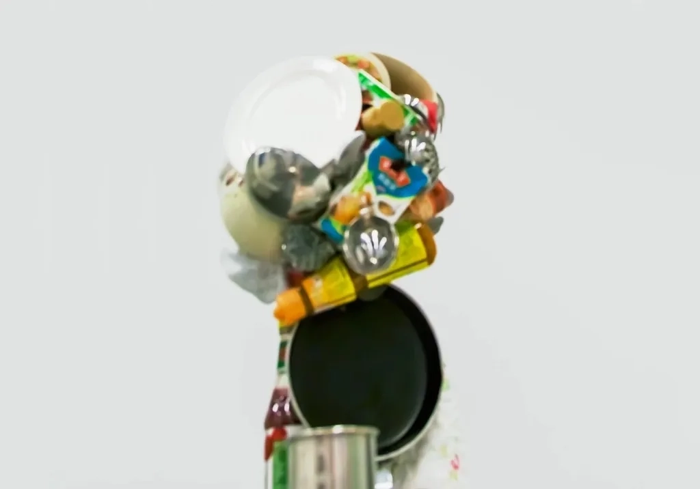

[HI](../../)  ||  [WORKS](../../works/)  ||  [BLOG](../../writings/)  ||  [TALKS](../../talks/)  ||  [PRESS](../../press/)

# How I cook

Year: 2014  
Type: mixed-media installation with found objects, and LED light panel. Dimensions variable.

---

This is a shadow sculpture made from the everyday language of a Hong Kong family kitchen: plates, cans, sauces, condiments, and utensils gathered from my home or bought because they resembled the things my mother would use.

At first glance, it appears as a chaotic pile of cooking objects. Under light, it casts the silhouette of my mother.

I made this work in my bachelor's graduation year, when cooking had become a personal ritual of independence. At the time, I wanted to prove that I could take care of myself, grow beyond family dependency, and form a life that was my own.

The project began inside an advertising-design brief, but somewhere in the process it escaped the brief and became something more explorative and expressive. Looking back now, doing this piece was an early attempt to reject and embrace inheritance.

The objects carry both affection and resistance. My mother's presence is cast through the materials that shaped how I understand care, habit, authority, and memory.

After the graduation show ended, I dismantled the sculpture and used some of its ingredients to cook dinner for my mother: an ordinary home meal, with fried vegetables and steamed fish.

She responded with a slight nod of appreciation.

