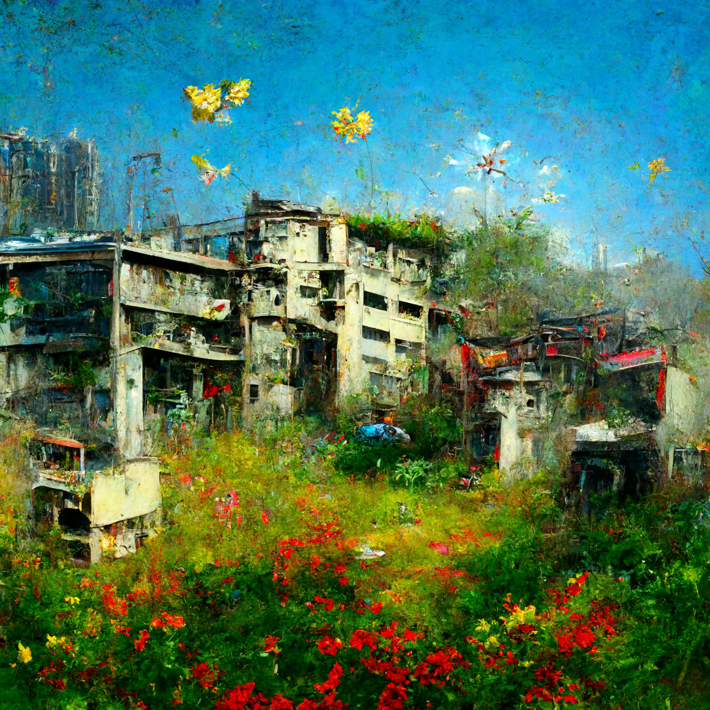
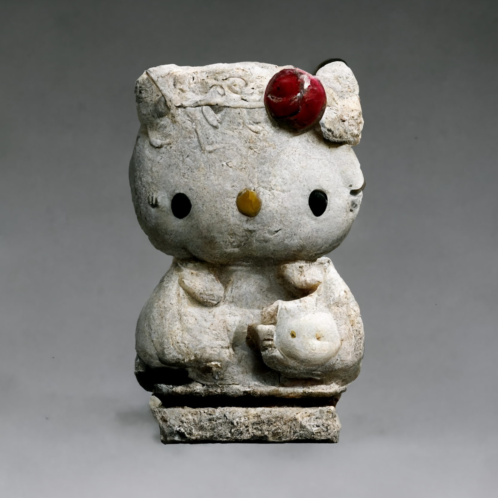

[☁ ABOUT](../../)  ||  [⛰ WORKS](../../works/)  ||  [⚯ WRITINGS](../../writings/)

# We are not the artists. We are the medium.

Published: 2022-08-01  
Author: Leo Lau

---

So I've been playing with this text-to-image generator [MidJourney](https://www.midjourney.com/) for a month, in an attempt to understand what it means to co-create with an AI. (Works on [Youtube](https://www.youtube.com/channel/UCPKOU1Y7qbnMxurgfvYIwCQ) and [Instagram](https://www.instagram.com/unun.leg/)) It's one thing to watch "Two Minute Papers", but quite another to get your hands dirty.

> *Image prompt: "a peaceful morning garden of Kowloon ruins, small butterflies and flower buds, kids playing, post apocalyptic oil painting, hyperdetailed"*

Shock and awe! This usually is the first reaction people have when they first see a great AI art piece (or any great art piece). I still remember such a sensation when I first saw Mario Klingemann's "Face Feedback III". [Mario Klingemann's "Face Feedback III"](https://www.youtube.com/watch?v=5h4R959O0cY) It's a process that started with being amused, then a fear that AI would replace humans someday, and finally indexing this uncanniness in my brain as a visual style among [many others on Aesthetics Wiki](https://aesthetics.fandom.com/wiki/List_of_Aesthetics).

However, the more I play with it, the more I feel like it's a new paradigm of art. Just like Surrealism and Pop art from the last century, we are witnessing a new art form that is fed and trained by the collective human experience (which we call datasets), and yet capable of hallucinating a reality that doesn't exist.

> *Image prompt: "hello kitty, marble statue, 8th century"*

AI art is neither a new style, nor a tool to create old art. AI art is a new medium for us to confront our existentialist fears. (A fear that machines are becoming more like us, and we are becoming more like them. A fear that our faces, our voices, and our unique identity can be compressed as a set of parameters, that we can tweak and export. A fear that authenticity is dead.)

In a way, the work we create with AI can never be authentic. They are often patchworks of social stereotypes and the remains dug up from artists' graves. However, this very "inauthenticity" or the lack of "full creative control" makes this art form unique. We upload prompts to summon the zeitgeist's ghost, almost like incantations. The ghost is forged by our data, past and present. Its eyes are our cameras. Its voice is our whispers and tweets. Like fingers on an Ouija board, we iteratively pull it back for creative control, while pushing it to speak what it wants to say. As a reward for their response, we give them our preferences and our tastes.

**We are not the artists. We are the medium.**

We first created the AI, and now the AI creates through us.

---
**Update (2025-11-12):**

Wrote the above piece 2 years ago when Midjourney was still on v2 / v3. Feeling nostalgic already for the aesthetics of imperfections and artefacts.

The existential dread and uncanny valley of GenAI have a different vibe now. Probably because my echo chamber/filter bubble is increasingly better at distinguishing the spammy “AI style” with a growing distaste. Plus, the interesting conversations have turned from shock and awe of AGI, to more nuanced topics like [Neo-luddism](https://en.m.wikipedia.org/wiki/Neo-Luddism)+[Primitivism](https://en.m.wikipedia.org/wiki/Anarcho-primitivism)+[Essentialism](https://en.m.wikipedia.org/wiki/Essentialism)+[Degrowth](https://en.m.wikipedia.org/wiki/Degrowth) v.s. [TESCREAL](https://en.m.wikipedia.org/wiki/TESCREAL)+[FALC](https://en.m.wikipedia.org/wiki/Fully_Automated_Luxury_Communism)+[Solarpunk](https://en.m.wikipedia.org/wiki/Solarpunk)+[E/ACC](https://en.m.wikipedia.org/wiki/Effective_accelerationism)

Amidst of this dialectical dialogue in the background, I have been experimenting with different AI tools to turn a childhood poem into an animated film. And this obscure feeling of “mixed-initiative-authenticity” has boggled my heart from time to time. 

It’s kind of weird and stimulating to use AI to deconstruct symbolism intimate to my past consciousness, and re-imagine them into words and visuals powered by the training dataset’s collective consciousness. It’s like playing soulful ping-pong with a janky prosthetic mind or with a parasitic alien genie.